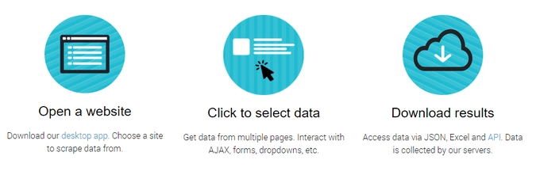
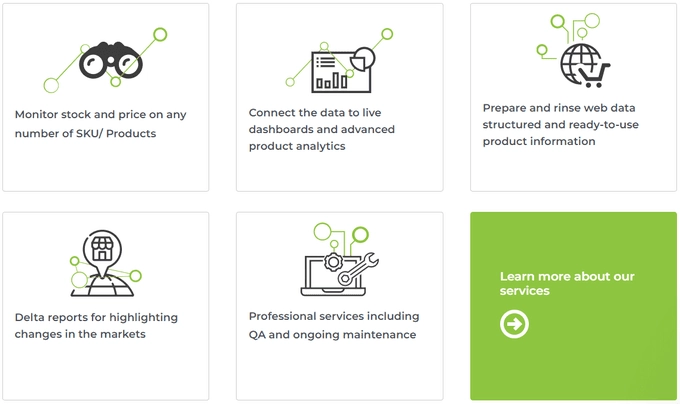
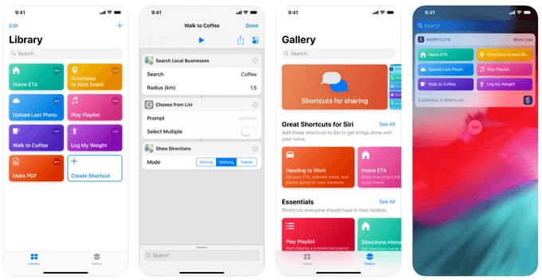
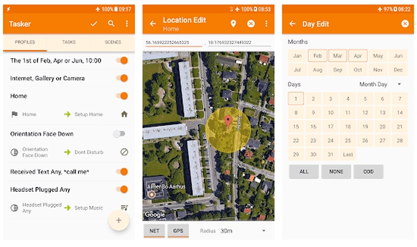

# 网络数据采集入门：从零开始抓取网站数据

不知道你发现没有，几乎每个行业现在都在用网络爬虫技术——电商平台监控竞品价格，招聘网站批量抓取职位信息，投资机构追踪市场动态。大公司都在靠这个赚钱，为什么我们不试试？

学会网络数据采集，你能找到全网最低价，为自己的生意挖掘潜在客户，甚至发现隐藏的工作机会。数据就是钱，只是看你会不会用。

---

## 专业爬虫服务：直接外包给别人干

最省事的办法？花钱请专业团队帮你搞定。

如果你需要采集海量数据，[Scrapinghub](https://www.scrapinghub.com/) 这种大规模服务商值得考虑。但对于普通需求，[ParseHub](https://www.parsehub.com/) 更接地气——新用户直接送200页免费额度，不用绑卡，后续按需付费。

## 浏览器插件：最接地气的工具

想要快速、免费又方便？**Web Scraper Chrome扩展程序**就够了。

刚开始可能有点懵，但开发者准备了详细的文档和视频教程。这玩意儿在小规模数据采集工具里算是顶配，免费版给的功能比大多数付费工具还多。

## Excel也能爬数据：最熟悉的老朋友

不想学新工具？打开Excel就行。

Microsoft Excel自带基础的网络数据抓取功能。新建工作簿，点击"数据"选项卡，选择"从Web"，跟着向导走就完事了。之后你可以把数据保存成各种格式。

## Python爬虫库：程序员的最爱

### Scrapy：专业级框架

会Python？那[Scrapy](https://scrapy.org/)就是为你准备的。你可以自定义"蜘蛛"程序，让它们自动爬网站、提取信息。采集的数据可以直接用在你的程序里，也能导出成文件。

Scrapy的教程从基础爬虫一路讲到多爬虫定时采集的专业玩法。学会这个不只对自己有用——市场上懂Scrapy的开发者非常抢手，说不定能给你开辟一条新职业道路。

### Beautiful Soup：更容易上手

[Beautiful Soup](https://www.crummy.com/software/BeautifulSoup/bs4/doc/)是另一个Python爬虫库，比Scrapy资格更老。很多人觉得它比Scrapy好学。

功能虽然没Scrapy全面，但对大多数场景来说，它在功能性和易用性之间找到了完美平衡。

## API爬虫服务：把重活交给云端

自己写爬虫代码是一回事，但代码得在本地跑。小打小闹还行，数据量一大就开始吃带宽，搞不好整个网络都变慢。

用API爬虫服务可以把工作转移到远程服务器，你只需要通过代码调用就行。专业级的有[Dexi](https://www.dexi.io/)，简单实用的有👉 [ScraperAPI——企业级数据采集的最佳选择](https://www.scraperapi.com/?fp_ref=coupons)。

虽然都要花钱，但ScraperAPI提供1000次免费API调用，你可以先试试效果再决定要不要付费。

## 自动化工具：不写代码也能玩转数据

### IFTTT：连接万物的神器

[IFTTT](https://ifttt.com/)是个强大的自动化平台，几乎能自动化任何事情，包括数据采集和网络爬虫。

它最大的优势是能跟一堆网络服务打通。举个简单例子，用Twitter做监控：

打开IFTTT选择"创建"，选Twitter服务，设置"新推文搜索"，输入关键词或话题标签，点"创建触发器"。然后选Google Sheets作为动作，选"添加行到表格"，按步骤操作，最后点"创建动作"。

几步操作下来，你就搞定了一个自动服务——它会记录所有相关推文、用户名和发布时间。

IFTTT支持的服务太多了，对于简单的数据采集任务来说，它和它的替代品都是完美工具。

### iPhone用户的秘密武器

iOS用户可以用[快捷指令](https://apps.apple.com/us/app/shortcuts/id915249334)这个App。它不只能连接你的日历、通讯录和地图，还能干更多事。

Reddit用户u/keveridge写过一篇详细教程，教你怎么用正则表达式配合快捷指令从网站提取详细信息。正则表达式能做非常精准的搜索，还能跨文件工作，只返回你需要的那部分数据。

### Android用户看这里：Tasker

Android没有简单的原生方案，但可以用IFTTT，或者试试Tasker。

[Play商店售价3.5美元](https://play.google.com/store/apps/details?id=net.dinglisch.android.taskerm&hl=en_US)，很多人把Tasker看作IFTTT的加强版。它的自动化选项更丰富，包括自定义网络搜索、网站数据变化提醒、从Twitter下载内容等。

虽然不是传统意义上的爬虫工具，但自动化应用能提供很多专业爬虫工具的功能，而且不用学编程也不用付费订阅在线服务。

---

## 结语

想为生意收集情报也好，让生活更方便也罢，网络数据采集都是值得掌握的技能。

把采集到的信息好好整理分类，你就能获得关于自己、朋友或客户所关心事物的全新视角。如果你正在寻找一个稳定、覆盖范围广、易于集成的企业级爬虫解决方案，[ScraperAPI能帮你节省大量时间和技术成本](https://www.scraperapi.com/?fp_ref=coupons)——它处理了IP轮换、验证码破解、浏览器指纹等所有复杂问题,让你专注于数据本身。
